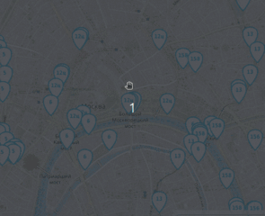

## Автобусы на карте Москвы
Веб-приложение для отслеживания движения общественного транспорта в реальном времени. Проект состоит из трёх компонентов: имитатора автобусов, сервера и фронтенда (карта в браузере).

```fake_bus.py``` — имитирует движение автобусов по маршрутам, отправляя координаты на сервер.

```server.py``` — принимает данные от имитаторов, хранит актуальное состояние, фильтрует автобусы по видимой области и передаёт их браузерам.

```index.html``` — отображает карту с маркерами автобусов, обновляя их каждую секунду.



## Как запустить

- Скачайте код
- Установите зависимости (python должен быть установлен)
```
pip install -r requirments.txt
```
- Подготовьте маршруты. Для этого создайте папку routes  и положите в неё JSON-файлы с маршрутами (например, 156.json). Каждый файл должен содержать:
```
{
  "name": "156",
  "coordinates": [
    [55.747629944737, 37.641726387317],
    [55.74771434896, 37.641817930892],
    ...
  ]
}
```
- запустите сервер
  ```
  python server.py
  ```
- запустите имитатор автобусов
  ```
  python fake_bus.py
  ```
- Откройте в браузере файл index.html

## Настройки

Внизу справа на странице можно включить отладочный режим логгирования и указать нестандартный адрес веб-сокета.


Настройки сохраняются в Local Storage браузера и не пропадают после обновления страницы. Чтобы сбросить настройки удалите ключи из Local Storage с помощью Chrome Dev Tools —> Вкладка Application —> Local Storage.

Если что-то работает не так, как ожидалось, то начните с включения отладочного режима логгирования.

## Формат данных

Фронтенд ожидает получить от сервера JSON сообщение со списком автобусов:

```js
{
  "msgType": "Buses",
  "buses": [
    {"busId": "c790сс", "lat": 55.7500, "lng": 37.600, "route": "120"},
    {"busId": "a134aa", "lat": 55.7494, "lng": 37.621, "route": "670к"},
  ]
}
```

Те автобусы, что не попали в список `buses` последнего сообщения от сервера будут удалены с карты.

Фронтенд отслеживает перемещение пользователя по карте и отправляет на сервер новые координаты окна:

```js
{
  "msgType": "newBounds",
  "data": {
    "east_lng": 37.65563964843751,
    "north_lat": 55.77367652953477,
    "south_lat": 55.72628839374007,
    "west_lng": 37.54440307617188,
  },
}
```


## Используемые библиотеки

- [Leaflet](https://leafletjs.com/) — отрисовка карты
- [loglevel](https://www.npmjs.com/package/loglevel) для логгирования


## Цели проекта

Код написан в учебных целях — это урок в курсе по Python и веб-разработке на сайте [Devman](https://dvmn.org).
